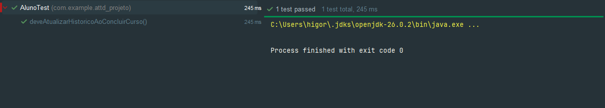
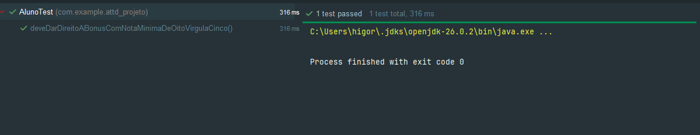

# AC1 DevOps — recompensa por conclusão de curso

Um aluno do plano básico ganha **3 cursos gratuitos** ao concluir um curso com nota **igual ou superior a 8,5**. Notas inferiores a 8,5 não liberam cursos extras.

## BDD 1 — nota 8,5 libera três cursos

**Dado** um aluno do plano básico com um curso em andamento, **quando** ele conclui o curso com nota 8,5, **então** a conclusão é registrada no histórico e três cursos extras são liberados.

### 1. Red — cenário BDD 1

O teste `bdd1_deveLiberarTresCursosComNotaOitoVirgulaCinco` falhou com **3 cursos esperados e 0 obtidos**. A regra de bônus ainda estava incorreta, comprovando que o cenário detecta a ausência do resultado exigido.


### 2. Green — TDD 1 da BDD 1

O teste `deveAtualizarHistoricoAoConcluirCurso` passou: a nota 8,5 foi registrada no histórico do aluno.



### 3. Green — TDD 2 da BDD 1

O teste `deveDarDireitoABonusComNotaMinimaDeOitoVirgulaCinco` passou: a nota mínima 8,5 dá direito ao bônus.



### 4. Green — TDD 3 da BDD 1

O teste `deveLiberarTresCursosComNotaMinimaDeOitoVirgulaCinco` valida que a conclusão com nota 8,5 libera exatamente três cursos extras.


## Como reproduzir

O print Red registra o estado anterior à implementação da regra. Para reproduzi-lo temporariamente, substitua o retorno de `temDireitoABonus` por `return false;` e execute somente o BDD 1:

```powershell
.\mvnw.cmd "-Dtest=AlunoTest#bdd1_deveLiberarTresCursosComNotaOitoVirgulaCinco" test
```

Restaure `return plano == Plano.BASICO && nota >= NOTA_MINIMA_PARA_BONUS;` e execute os testes da BDD 1 para obter o Green:

```powershell
.\mvnw.cmd "-Dtest=AlunoTest#deveAtualizarHistoricoAoConcluirCurso" test
.\mvnw.cmd "-Dtest=AlunoTest#deveDarDireitoABonusComNotaMinimaDeOitoVirgulaCinco" test
.\mvnw.cmd "-Dtest=AlunoTest#deveLiberarTresCursosComNotaMinimaDeOitoVirgulaCinco" test
```

A refatoração Blue separa o registro no histórico da concessão de cursos nos métodos `registrarConclusao` e `liberarCursosSeElegivel`. A regra fica centralizada em `temDireitoABonus`, e os quatro testes continuam passando.
