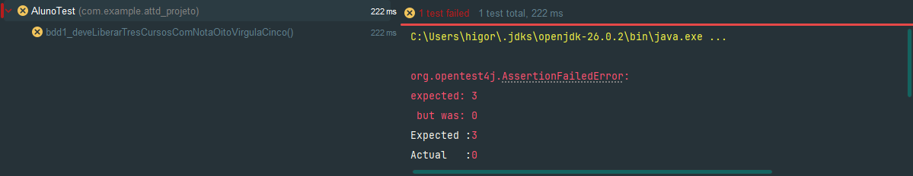
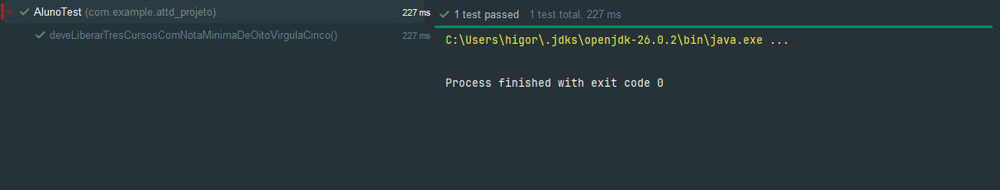
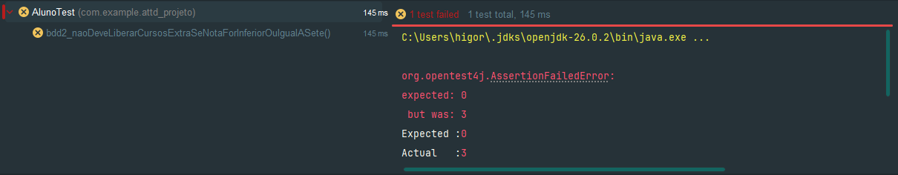
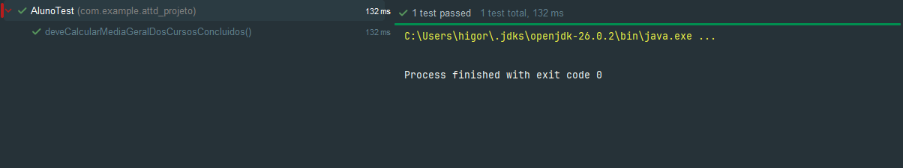
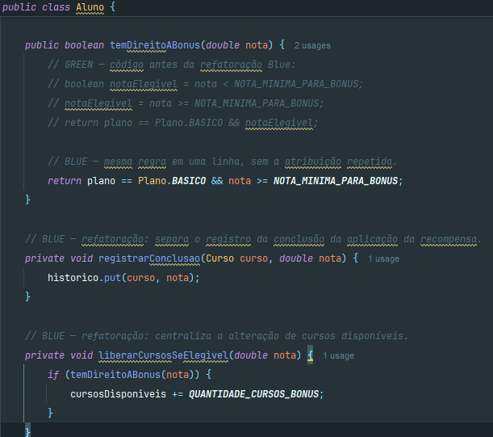

# Trabalho de DevOps

A ideia do projeto é que o aluno do plano básico ganhe 3 cursos grátis quando termina um curso com nota 8,5 ou maior. Se tirar menos que 8,5, ele não ganha esses cursos.

## BDD 1

O João termina um curso com nota 8,5. A nota precisa ficar salva no histórico e ele deve ganhar mais 3 cursos.

### Red da BDD 1

No começo deu erro: o teste esperava 3 cursos, mas o aluno ficou com 0.

### Green do TDD 1

Esse teste vê se a nota do curso ficou salva no histórico.

### Green do TDD 2

Aqui testamos se a nota 8,5 dá direito ao bônus.

### Green do TDD 3

Aqui testamos se os 3 cursos foram liberados.

## BDD 2

Nessa parte, o aluno não pode ganhar cursos extras com nota 7,0 ou menor.

### Red da BDD 2

No começo o teste deu erro: era para ficar com 0 cursos extras, mas liberou 3.

### Green do TDD 1

Testamos a nota 7,0. Ela não deve liberar cursos extras.

### Green do TDD 2

Aqui testamos a nota 5,5, que também não libera cursos extras.

### Green do TDD 3

O último teste confere a média dos cursos com notas 9,0 e 4,0. No projeto, a média é mostrada como número inteiro, então o resultado é 6.

## Red, Green e Blue no código

No Red, a linha que corrigia a nota mínima ficou como comentário. Por isso a comparação errada da linha de cima ainda era usada, e os BDDs falharam. Depois tiramos o comentário da correção e os testes Green passaram.

Para mostrar o Blue, deixamos o código antigo de `temDireitoABonus` comentado em `Aluno.java` e usamos só a regra refatorada logo abaixo. O código também separa o registro no histórico da liberação dos cursos.

Esse é o print do Blue: o código antigo ficou comentado e a refatoração está funcionando. Depois dessa mudança, os testes continuaram passando.

