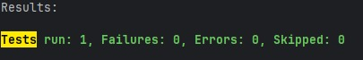

# Projeto DevOps

## Sobre o caso

O caso fala de uma plataforma de cursos online por assinatura. O aluno do plano básico paga uma mensalidade e tem acesso a cursos. Quando termina um curso com uma nota boa, ele ganha mais cursos. O aluno também pode ganhar curso participando do fórum. Depois de conquistar 12 cursos, passa para o plano Premium e ganha outras vantagens.

Neste projeto, foi escolhida a parte em que o aluno do plano básico ganha 3 cursos quando tira nota maior ou igual a 8,5.

## User Story escolhida

**Quem escreveu: Gabriel Baldi**

> Como aluno do plano básico, quero ganhar 3 cursos quando terminar um curso com nota maior ou igual a 8,5 para continuar estudando sem pagar mais por isso.

## BDDs feitos

### BDD 1 - Gabriel Baldi

João é aluno do plano básico e termina um curso com nota 8,5. A nota precisa ficar no histórico e ele deve ganhar 3 cursos.

### BDD 2 - Higor Aranda

Maria é aluna do plano básico e termina um curso com nota 7,0. Ela não deve ganhar cursos extras.

## TDD

### RED

No RED os testes falham porque a regra ainda não estava pronta.

**BDD 1 falhando**


**BDD 2 falhando**


### GREEN

No GREEN a regra foi implementada e os testes passaram.

**BDD 1 - testes passando**


**BDD 2 - testes passando**


### BLUE

No BLUE o código foi organizado sem mudar o resultado dos testes. A cobertura da regra original ficou em 100%, sem partes em vermelho ou amarelo.


## Organização do projeto

O projeto está separado assim:

- `controller`: recebe as requisições da API;
- `service`: aplica as regras;
- `repository`: conversa com o banco;
- `domain`: classes `Aluno`, `Curso` e `Plano`;
- `dto`: dados que entram e saem da API.

## Swagger

Com a aplicação rodando, abra:

```text
http://localhost:8080/swagger-ui.html
```

O JSON da documentação fica em:

```text
http://localhost:8080/v3/api-docs
```

## Endpoints

| Método | Endpoint | O que faz |
| --- | --- | --- |
| POST | `/api/alunos` | Cria um aluno |
| GET | `/api/alunos` | Lista alunos |
| GET | `/api/alunos/{id}` | Busca um aluno |
| POST | `/api/cursos` | Cria um curso |
| GET | `/api/cursos` | Lista cursos |
| POST | `/api/alunos/{id}/concluir-curso` | Conclui um curso e verifica o bônus |

Exemplo para criar aluno:

```json
{ "nome": "João", "plano": "BASICO" }
```

Exemplo para criar curso:

```json
{ "nome": "Docker" }
```

Exemplo para concluir curso:

```json
{ "cursoId": 1, "nota": 8.5 }
```

## Banco de dados

### H2

Foi feito um teste de integração usando H2 em memória. Ele cria aluno e curso, salva a conclusão e verifica os 3 cursos de bônus.

Resultado: teste executado com sucesso, 0 falhas e 0 erros.



### PostgreSQL

O PostgreSQL está configurado no `docker-compose.yml`. O banco criado é o `devops_db` e a porta é `5432`.

Depois de subir o Docker, estes comandos mostram a evidência:

```powershell
docker compose ps
docker compose logs db
```

## Rodando com Docker

Abra o terminal dentro da pasta `DEVOPS` e rode:

```powershell
docker compose up --build
```

Depois abra o Swagger em `http://localhost:8080/swagger-ui.html`.

Para parar tudo:

```powershell
docker compose down -v
```

## Rodando os testes

Com Java 17 ou superior:

```powershell
.\mvnw.cmd test
```
